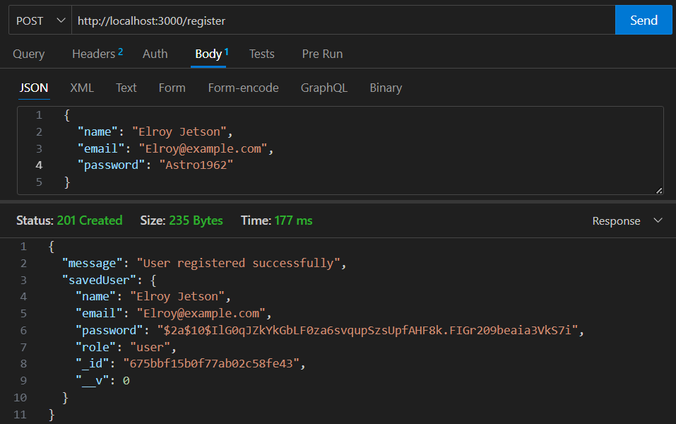
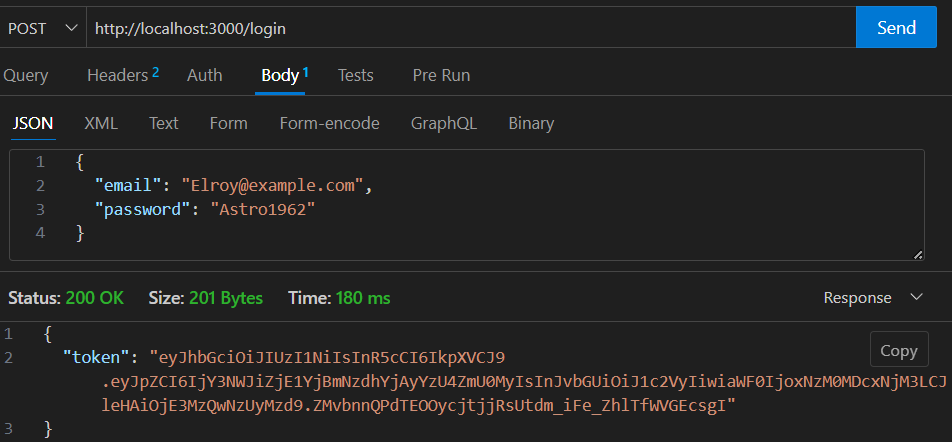
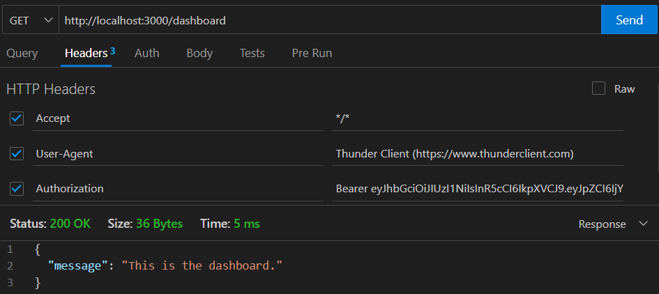
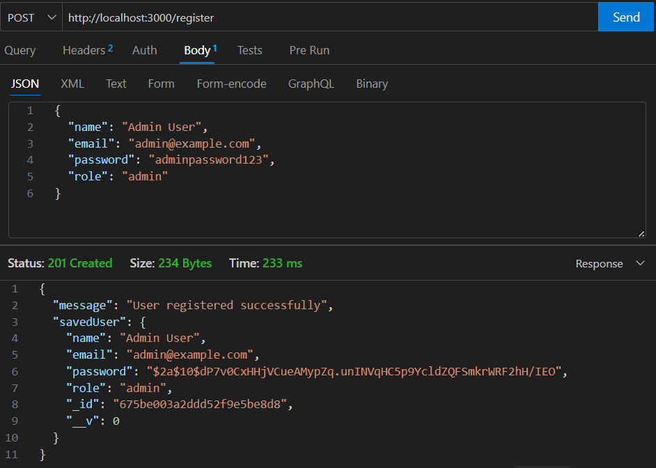
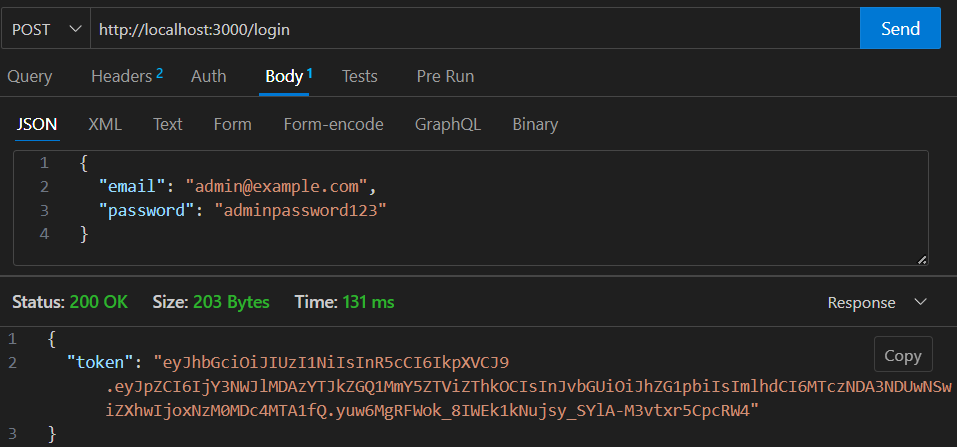
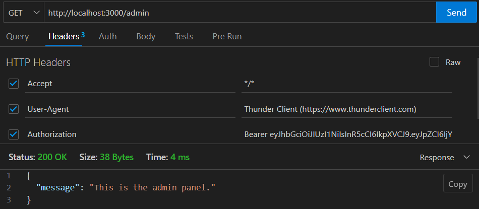
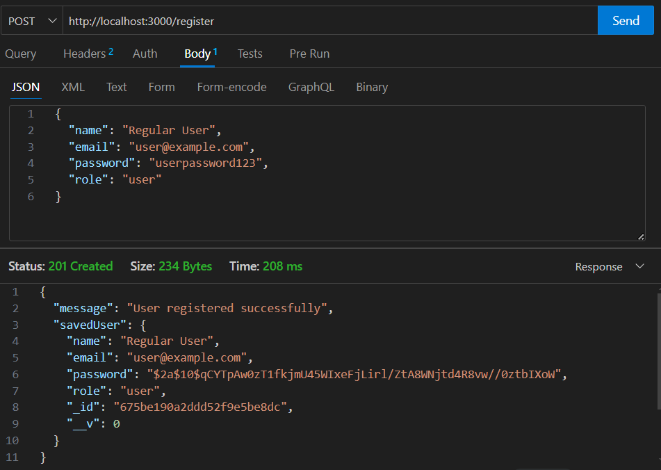
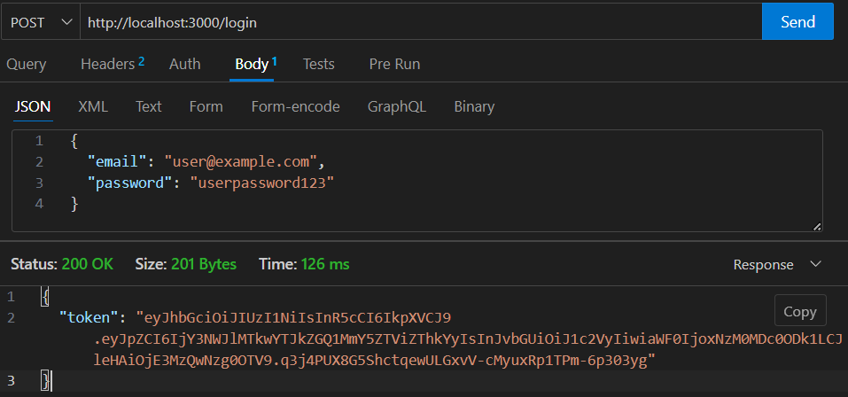
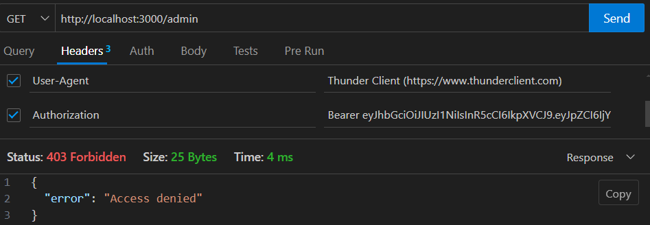

# Express Role-Based Access Control (RBAC) Project

## Overview and Objective

This project demonstrates the implementation of Role-Based Access Control (RBAC) using Express.js, MongoDB, and JWT authentication. The application provides a simple framework for user registration, login, protected routes, and role-specific permissions. Key features include:

- User authentication using JWT tokens.
- Password hashing for secure user credentials.
- Role-based access to specific routes (e.g., admin-only access).
- Middleware for route protection and role validation.

---

## Project Setup

1. **Create Repository**:

   - Initialized a GitHub repository with a README and a `.gitignore` file configured for Node.js.
   - Cloned the repository locally.

2. **Install Dependencies**:

   ```bash
   npm install express mongoose bcryptjs jsonwebtoken dotenv
   ```

3. **Environment Configuration**:

   - Created a `.env` file to store the JWT secret and MongoDB connection URL:
     ```env
     JWT_SECRET=your_jwt_secret_key
     MONGO_URL=your_mongo_db_connection_string
     ```
     - Used [RandomKeygen](https://randomkeygen.com) to generate a strong JWT secret key.

4. **Start the Server**:
   ```bash
   node index.js
   ```

---

## Defining the User Schema with Role and Password Hashing

**File:** `models/user.js`

- The `User` schema includes fields for `name`, `email`, `password`, and `role`. Passwords are hashed using the `bcryptjs` library before saving to the database.

**Example Code:**

```javascript
userSchema.pre("save", async function (next) {
  const salt = await bcrypt.genSalt(10);
  const encryptedPassword = await bcrypt.hash(this.password, salt);
  this.password = encryptedPassword;
  next();
});
```

---

## Implementing Registration and Login Endpoints

**File:** `index.js`

1. **Register Endpoint:**

   - Validates if the email already exists.
   - Hashes the user’s password and saves the user in the database.

2. **Login Endpoint:**
   - Validates user credentials.
   - Issues a JWT token upon successful authentication.

**Example Code:**

```javascript
app.post("/register", async (req, res) => {
  const { name, email, password, role } = req.body;
  try {
    const newUser = new User({ name, email, password, role });
    const savedUser = await newUser.save();
    res
      .status(201)
      .json({ message: "User registered successfully", savedUser });
  } catch (error) {
    res.status(500).json({ error: "Error registering user" });
  }
});

// Login Endpoint
app.post("/login", async (req, res) => {
  const { email, password } = req.body;
  try {
    const user = await User.findOne({ email });

    await bcrypt.compare(password, user.password);

    const token = jwt.sign(
      { id: user._id, role: user.role },
      process.env.JWT_SECRET,
      { expiresIn: "1h" }
    );

    res.json({ message: "Login successful", token });
  } catch (error) {
    res.status(500).json({ error: "Error logging in" });
  }
});
```

---

## Testing Registration and Login Endpoints

**Tools Used:** Thunder Client

- **Registration Test:** Successfully registered a user with `POST /register`.
- **Login Test:** Validated login functionality with `POST /login`.

**Screenshots:**

- Registration test result.  
   
- Login test result.  
   

---

## Implementing Middleware for Route Protection

**File:** `middleware/auth.js`

- Verifies the JWT token from the Authorization header.
- Decodes the token to extract user information for further validation.

**Example Code:**

```javascript
function auth(req, res, next) {
  const authHeader = req.headers.authorization;
  if (!authHeader || !authHeader.startsWith("Bearer ")) {
    return res.status(401).json({ error: "Unauthorized" });
  }

  const token = authHeader.split(" ")[1];
  try {
    const decoded = jwt.verify(token, process.env.JWT_SECRET);
    req.user = decoded;
    next();
  } catch (error) {
    res.status(401).json({ error: "Unauthorized" });
  }
}
```

---

## Protecting Routes with Authentication Middleware

**Example Route:**

```javascript
app.get("/dashboard", auth, (req, res) => {
  res.json({ message: "This is the dashboard." });
});
```

**Testing Protected Routes:**

- Verified that access to `/dashboard` is denied without a valid JWT token.
- Tested access with a valid token using Thunder Client.

**Screenshot:** Protected route test result.  
 

---

## Implementing Role-Based Access Control

**File:** `middleware/role.js`

- Checks if the user’s role matches the required role for the route.
- Denies access with a `403` status code if the role does not match.

**Example Code:**

```javascript
function role(requiredRole) {
  return (req, res, next) => {
    if (req.user.role !== requiredRole) {
      return res.status(403).json({ error: "Access denied" });
    }
    next();
  };
}
```

**Example Route:**

```javascript
app.get("/admin", auth, role("admin"), (req, res) => {
  res.json({ message: "This is the admin panel." });
});
```

---

## Testing Role-Based Access Control

- Tested `/admin` with different roles using Thunder Client.
- Verified that only users with the `admin` role can access the route.

**Screenshots:** Role-based access test results.

- **For Admin**  
    
    
  

- **For User**  
    
    
  

---

## What I Learned: JWT Tokens

JWT (JSON Web Tokens) are an industry-standard method for securely transmitting information between two parties.

### Key Components:

1. **Header:** Encodes metadata about the token, such as the signing algorithm.
2. **Payload:** Contains claims or data, such as `id` and `role`.
3. **Signature:** Verifies the token’s integrity using a secret key.

### Setting Up JWT:

1. **Generate a Token:**

   ```javascript
   const token = jwt.sign(
     { id: user._id, role: user.role },
     process.env.JWT_SECRET,
     {
       expiresIn: "1h",
     }
   );
   ```

2. **Verify a Token:**

   ```javascript
   const decoded = jwt.verify(token, process.env.JWT_SECRET);
   ```

3. **Send Token in Response:**

   ```javascript
   res.json({ token });
   ```

4. **Use Token in Requests:** Include the token in the `Authorization` header:
   ```http
   Authorization: Bearer <token>
   ```

### Resources:

#### Articles

- [What is a JWT?](https://supertokens.com/blog/what-is-jwt#)
- [JSON Web Tokens (JWT)](https://arielweinberger.medium.com/json-web-token-jwt-the-only-explanation-youll-ever-need-cf53f0822f50)

#### Videos

[](https://www.youtube.com/watch?v=Y2H3DXDeS3Q)  
[](https://www.youtube.com/watch?v=mbsmsi7l3r4)

---

## Conclusion

This project provided a hands-on experience with implementing authentication, authorization, and role-based access control in an Express.js application. The use of JWT tokens for secure communication and the modular middleware design for authentication and role validation are highly scalable and can be adapted for more complex applications.
